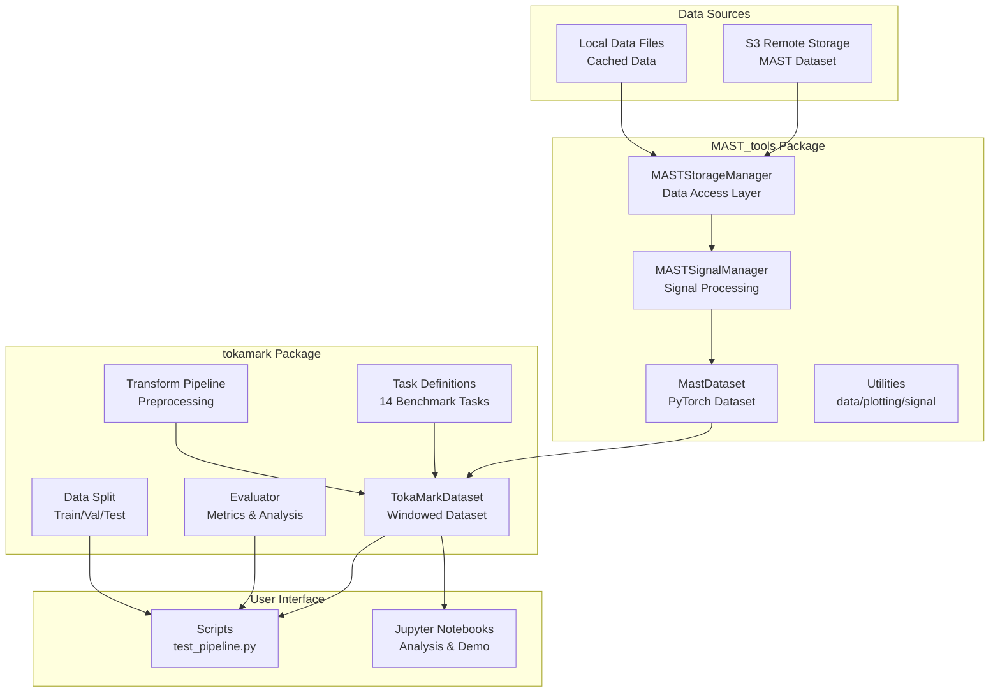
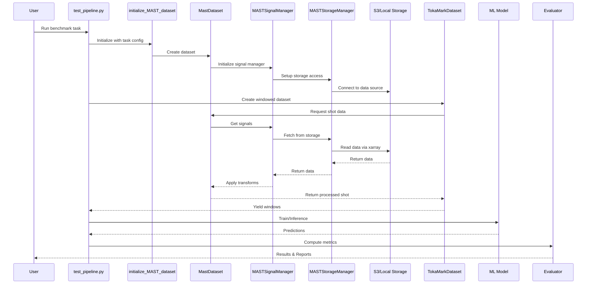

# TokaMark: A Comprehensive Benchmark for MAST Tokamak Plasma Models

## Overview

**TokaMark** is a Python-based system for preprocessing fusion plasma data from the MAST (Mega Ampere Spherical 
Tokamak) facility and providing benchmark tasks for machine learning models. The architecture follows a modular design 
with two main packages:

1. **`MAST_tools`** - Core data access and utilities
2. **`tokamark`** - Benchmark tasks, datasets, and evaluation framework

The code in this repository corresponds to the official implementation of the **TokaMark benchmark** introduced in the 
paper [TokaMark: A Comprehensive Benchmark for MAST Tokamak Plasma Models](https://arxiv.org/abs/2602.10132).

Companion resources:

* <ins>**TokaMark Dataset:**</ins> A curated dataset for use with TokaMark, available via the following configuration 
settings:
```python
{
    "s3_endpoint_url": "https://s3.echo.stfc.ac.uk",
    "s3_mast_dataset_path": "/mast/tokamark/v1",
    "base_fsspec_protocol":"simplecache",
    "target_fsspec_protocol"="s3"
 }
```

* <ins>**TokaMark Baseline:**</ins> A baseline CNN model for the TokaMark benchmark.

* <ins>**TokaMind:**</ins> A Python-based system implementing the multi-modal, token-based Transformer pipeline for scientific and 
industrial signals, introduced in the paper [TokaMind: A Multi-Modal Transformer Foundation Model for Tokamak Plasma 
Dynamics](https://arxiv.org/abs/2602.15084).

---

## 📦 Initial setup

1. Clone the repository and move to the installation directory.
2. Use conda to set up and activate a virtual environment with basic dependencies: 
   ```bash
   conda env create -f environment_basic.yml
   conda activate tokamark-env
   ```
3. Run the command for the package-like installation of the project following [PEP 518](https://peps.python.org/pep-0518/)
   requirements (which makes use of the provided `pyproject.toml` file):
   ```bash
   pip install -e .
   ```
4. **[OPTIONAL]** For experiments using a local database (Zarr or netCDF), download and install 
the dataset under `/mast/tokamark/v1`. 

    * **REMARK:** Installation of the local dataset under a different directory is possible, but requires setting 
    variable `DEFAULT_BASE_LOCAL_DATA_PATH` in module `./src/MAST_tools/utils/store_utils.py` with the appropriate path. 


5. **[OPTIONAL]** For contributors, install dev dependencies and enable pre-commit hooks:
    ```bash
    pip install -e ".[dev]"
    pre-commit install
    pre-commit run --all-files   # Recommended once after setup
    ```

The pre-commit configuration runs `ruff check` and `ruff format`.

---

## High-Level Architecture


---

## Core Components

### 1. Data Access Layer (`MAST_tools`)

#### **MASTStorageManager** (`src/MAST_tools/utils/store_utils.py`)
- **Purpose**: Manages access to MAST data, stored either in Zarr or netCDF format
- **Key Features**:
  - Backend-agnostic: all reads go through `xarray`, selected by the `data_format` setting (`"zarr"` or `"netcdf"`)
  - Supports both local and remote (S3) data sources
  - Uses `fsspec` for filesystem abstraction
  - Implements caching with `simplecache` protocol
  - Provides shot-level data access
- **Configuration**:
  - S3 endpoint: `https://s3.echo.stfc.ac.uk`
  - Dataset path: `/mast/tokamark/v1`
  - Local data path: `/mast/tokamark/v1`
- **Key Methods**:
  - `list_all_shots()`: List available shot IDs
  - `list_shots_by_signal_availability()`: Filter shots by signal availability
  - `make_shot_store()`: Create the data source handle (local path or remote URI) for a shot
  - `make_shot_group()`: Open a shot as an `xarray.DataTree` (one child node per source)
  - `open_shot_group()`: Same as above, as a context manager that closes the tree on exit
  - `get_all_signals_in_store()`: List all signals in a store

#### **MASTSignalManager** (`src/MAST_tools/utils/signal_utils.py`)
- **Purpose**: High-level interface for retrieving signals from shots
- **Key Methods**:
  - `get_signal_values()`: Extract signal data
  - `get_signal_times_and_time_type()`: Get temporal information
  - `get_signal_profile()`: Retrieve profile data
  - `get_channel_names()`: List available channels
  - `get_source_profiles()`: Get all profiles from a source

#### **MastDataset** (`src/MAST_tools/MAST_dataset.py`)
- **Purpose**: PyTorch Dataset wrapper for MAST data
- **Features**:
  - Lazy loading of shot data
  - Signal-level transforms
  - Handles incomplete shots
  - Outlier removal support
- **Key Methods**:
  - `__getitem__(idx)`: Return samples by shot index
  - `get_shot_id(idx)`: Return shot ID from index
  - `get_windows_for_shot(idx)`: Return windows for a shot
- **Includes**: `CachedDataset` for in-memory caching

---

### 2. Benchmark Framework (`tokamark`)

#### **Task System** (`src/tokamark/tasks.py`)
- **14 Benchmark Tasks** organized in 4 groups:
  - **Group 1**: Reconstruction (tasks 1-1, 1-2, 1-3)
  - **Group 2**: Magnetics Dynamics (tasks 2-1, 2-2, 2-3)
  - **Group 3**: Profiles Dynamics (tasks 3-1, 3-2, 3-3)
  - **Group 4**: MHD Activity (tasks 4-1 through 4-5)
- **Configuration**: YAML files in `src/tokamark/tasks_configs/`
- **Key Functions**:
  - `get_task_config(task_name)`: Load task configuration
  - `get_signals_metadata(file_path)`: Load signal statistics
  - `get_task_metadata(config_task)`: Extract task metadata

#### **TokaMarkDataset** (`src/tokamark/tools/TokaMark_dataset.py`)
- **Purpose**: Iterable dataset for windowed time-series data
- **Features**:
  - Sliding window generation
  - Streaming shuffle buffer
  - Multi-worker support
  - NaN handling
  - Input/actuator/output separation
- **Key Methods**:
  - `__iter__()`: Generate windowed samples
  - `_shuffle_buffer()`: Streaming shuffle implementation

#### **Transform Pipeline** (`src/tokamark/tools/MAST_composite_transform.py`)
- **Purpose**: Composable data transformations
- **Available Transforms**:
  - `StdScalingTransform`: Standardization using mean/std
  - `ReshapeLcfsTransform`: LCFS (Last Closed Flux Surface) reshaping
  - `FillProfileWithZerosTransform`: Zero imputation for missing values
  - `STFTTransform`: Short-time Fourier transform
  - `ComposeTransforms`: Transform composition
- **Key Function**:
  - `build_common_signal_transform_map()`: Build transform map for signals

#### **Evaluation System** (`src/tokamark/evaluator.py`)
- **Purpose**: Comprehensive metrics computation and aggregation
- **Metrics Hierarchy**:
  1. **Window-level**: RMSE, MAE per window
  2. **Shot-level**: Aggregated per shot
  3. **Signal-level**: Aggregated per signal
  4. **Task-level**: NRMSE, NMAE, RMSE, MAE
  5. **Group-level**: Aggregated across tasks
- **Key Functions**:
  - `compute_windows_metrics()`: Per-window metrics
  - `compute_metrics()`: Full evaluation pipeline
  - `compute_summary_metrics()`: Cross-task aggregation
- **Output Files**:
  - `windows_metrics.csv`: Per-window results
  - `shots_metrics.csv`: Per-shot aggregation
  - `task_metrics.csv`: Per-task summary
  - `signals_metrics.csv`: Per-signal summary
  - `groups_metrics.csv`: Per-group summary

#### **Data Splitting** (`src/tokamark/data_split.py`)
- **Purpose**: Manage train/validation/test splits
- **Features**:
  - Predefined splits in `src/tokamark/metadata/TokaMark_data_splits.csv`
  - Subset selection support
  - Shuffle capability with seed control
- **Key Function**: `get_train_test_val_shots()`: Generate shot lists for each split

---

## Data Flow


Data flow explained through the use of `testp_pipeline.py`:

```
User Request
    │
    ▼
test_pipeline.py (Script)
    │
    ├─► get_task_config() ──► Load task YAML
    │
    ├─► get_train_test_val_shots() ──► Load data splits
    │
    ├─► initialize_MAST_dataset()
    │       │
    │       ├─► MastDataset.__init__()
    │       │       │
    │       │       └─► MASTSignalManager.__init__()
    │       │               │
    │       │               └─► MASTStorageManager.__init__()
    │       │                       │
    │       │                       └─► Connect to S3/Local Storage
    │       │
    │       └─► build_common_signal_transform_map()
    │
    ├─► initialize_TokaMark_dataset()
    │       │
    │       └─► TokaMarkDataset.__init__()
    │
    ├─► DataLoader (PyTorch)
    │       │
    │       └─► TokaMarkDataset.__iter__()
    │               │
    │               ├─► MastDataset.__getitem__()
    │               │       │
    │               │       ├─► MASTSignalManager.get_signal_values()
    │               │       │       │
    │               │       │       └─► MASTStorageManager.make_shot_store()
    │               │       │               │
    │               │       │               └─► Read via xarray (Zarr/netCDF, S3/Local)
    │               │       │
    │               │       └─► Apply signal transforms
    │               │
    │               └─► Generate windows
    │
    ├─► Model Training/Inference
    │       │
    │       └─► Generate predictions
    │
    └─► Evaluator
            │
            ├─► compute_windows_metrics()
            ├─► compute_metrics()
            └─► compute_summary_metrics()
                    │
                    └─► Save CSV reports
```

Corresponding flow diagram:



---

## Key Design Patterns

### 1. **Layered Architecture**
- **Storage Layer**: `MASTStorageManager` - Handles data access via `xarray`
- **Signal Layer**: `MASTSignalManager` - Processes signals
- **Dataset Layer**: `MastDataset`, `TokaMarkDataset` - PyTorch integration
- **Application Layer**: Scripts and notebooks - User interface

### 2. **Transform Pipeline Pattern**
- Composable transforms using `ComposeTransforms`
- Signal-level transforms
- Configurable via `build_common_signal_transform_map()`
- Each transform is a callable class with `__call__()` method

### 3. **Configuration-Driven**
- Task definitions in YAML files (`tasks_configs/`)
- Signal statistics in `dict_signals_stats.yaml`
- Outlier metadata in `dict_outlier_metadata.yaml`
- Data splits in `TokaMark_data_splits.csv`

### 4. **Lazy Loading & Caching**
- `CachedDataset` for memory caching
- `fsspec` simplecache for disk caching
- On-demand data loading from the shot data store
- Reduces memory footprint and I/O operations

### 5. **Iterator Pattern**
- `TokaMarkDataset` implements `IterableDataset`
- Streaming data generation
- Shuffle buffer for randomization
- Multi-worker support for parallel loading

---

## Technology Stack

### Core Dependencies
- **Data Storage**: `xarray` (+ `zarr` / `h5netcdf` backends), `fsspec`, `s3fs`
- **ML Framework**: `torch`, `torchvision`, `tensordict`
- **Scientific Computing**: `numpy`, `scikit-learn`
- **Visualization**: `matplotlib`, `seaborn`, `opencv-python`
- **Optimization**: `optuna`
- **Development**: `jupyter`, `black`, `pytest`

### Data Format
- **Primary**: Zarr (chunked, compressed array storage); netCDF also supported via `data_format="netcdf"`
- **Metadata**: YAML, CSV
- **Artifacts**: CSV (statistics, metrics)

---

## 🗂️ Directory Structure

```
tokamark/
├── src/
│   ├── MAST_tools/                             # Core data access
│   │   ├── MAST_dataset.py                     # PyTorch dataset
│   │   ├── metadata/                           # Outliers, signals
│   │   │   ├── dict_outlier_metadata.yaml
│   │   │   ├── dict_sources_with_signals.yaml
│   │   │   └── signal_availability.csv
│   │   └── utils/                              # Storage, signals, plotting
│   │       ├── data_utils.py                   # Type definitions
│   │       ├── store_utils.py                  # MASTStorageManager
│   │       ├── signal_utils.py                 # MASTSignalManager
│   │       ├── plotting_utils.py               # Visualization
│   │       ├── general_utils.py                # Utilities
│   │       └── path_utils.py                   # Path constants
│   │
│   └── tokamark/                         # Benchmark framework
│       ├── data.py                             # Dataset initialization
│       ├── tasks.py                            # Task definitions
│       ├── evaluator.py                        # Metrics computation
│       ├── data_split.py                       # Train/val/test splits
│       ├── metadata/                           # Task configs, splits
│       │   ├── dict_signals_stats.yaml
│       │   └── TokaMark_data_splits.csv
│       ├── tasks_configs/                      # 14 task YAML files
│       │   ├── group_1_reconstruction/
│       │   ├── group_2_magnetics_dynamics/
│       │   ├── group_3_profiles_dynamics/
│       │   └── group_4_mhd_activity/
│       └── tools/                              # Transforms, utilities
│           ├── TokaMark_dataset.py
│           ├── MAST_composite_transform.py
│           ├── path.py
│           ├── utils.py
│           └── transforms/
│               ├── compose_transform.py
│               ├── stdscale_transform.py
│               ├── reshape_lcfs_transform.py
│               ├── fill_profile_with_zeros_imputer_transform.py
│               └── stft_transform.py
│
├── scripts/                                    # Execution scripts
│   ├── test_pipeline.py                        # Main benchmark runner
│   ├── persistence.py                          # Persistence model
│   └── preprocessing/                          # Data preprocessing
│       ├── run_get_metadata_per_shot.py
│       └── run_get_dict_stat_metadata.py
│
├── notebooks/                                  # Analysis notebooks
│   ├── Workshop demo of MAST_tools.ipynb
│   ├── Validation Tests for MAST_tools.ipynb
│   ├── evaluation.ipynb
│   └── data_stratification.ipynb
│
├── artifacts/                                  # Generated outputs
│   ├── shots_stats/                            # Shot statistics
│   └── signals_stats/                          # Signal statistics
│
├── tests/                                      # Unit tests
│   ├── run_tests.py
│   └── README.md
│
├── pyproject.toml                              # Project configuration
├── environment.yml                             # Conda environment
└── README.md                                   # Project documentation
```

---

## Usage Workflow

### 1. **Data Initialization**
```python
from tokamark.data import initialize_MAST_dataset
from tokamark.tasks import get_task_config
from tokamark.data_split import get_train_test_val_shots

# Load task configuration
config = get_task_config("task_1-1")

# Get data splits
train_shots, test_shots, val_shots = get_train_test_val_shots()

# Initialize dataset
dataset = initialize_MAST_dataset(
    config_task=config,
    shots_list=train_shots,
    local_flag=True,
    use_std_scaling=True,
    remove_outliers=True
)
```

### 2. **Create Windowed Dataset**
```python
from tokamark.data import initialize_TokaMark_dataset
from tokamark.tasks import get_task_metadata, get_signals_metadata

# Get metadata
task_metadata = get_task_metadata(config, verbose=False)
signals_metadata = get_signals_metadata()

# Create windowed dataset
tokamark_ds = initialize_TokaMark_dataset(
    dataset=dataset,
    task_metadata=task_metadata,
    config_metadata=signals_metadata,
    custom_transform=None
)
```

### 3. **Training/Evaluation**
```python
from torch.utils.data import DataLoader
from tokamark.evaluator import WindowMetricsAccumulator

# Create data loader
dataloader = DataLoader(
    tokamark_ds,
    batch_size=32,
    num_workers=4
)

# Initialize metrics accumulator
accumulator = WindowMetricsAccumulator(task="task_1-1")

# Training loop
for batch in dataloader:
    # Train model
    predictions = model(batch['x'])
    
    # Accumulate metrics
    accumulator.add_batch(
        y_target=batch['y'],
        y_pred=predictions,
        shot_ids=batch['shot_id'],
        window_indices=batch['window_index'],
        feature_names=batch['feature_names']
    )
```

### 4. **Compute Metrics**
```python
from tokamark.evaluator import compute_metrics, compute_summary_metrics

# Compute task-level metrics
compute_metrics(
    task="task_1-1",
    output_dir="results/",
    window_metrics_accumulator=accumulator,
    save_windows_metrics=True,
    save_shot_metrics=True,
    save_task_metrics=True
)

# After all tasks, compute summary
compute_summary_metrics(
    output_dir="results/",
    source="task_metrics"
)
```

---

## Potential Extension Points

### 1. **Adding New Tasks**
1. Create YAML config in `src/tokamark/tasks_configs/`
2. Define input/actuator/output signals
3. Specify window parameters
4. Add task to `TASKS_CONFIGS_MAP` in `tasks.py`

### 2. **Custom Transforms**
1. Create new transform class in `src/tokamark/tools/transforms/`
2. Implement `__init__()` and `__call__()` methods
3. Add to transform map in `MAST_composite_transform.py`

### 3. **New Metrics**
1. Extend `WindowMetricsAccumulator` in `evaluator.py`
2. Add metric computation in `compute_windows_metrics()`
3. Update aggregation logic in `compute_metrics()`

### 4. **Storage Backends**
1. Modify `MASTStorageManager` in `store_utils.py`
2. Add new filesystem protocol support
3. Update `_shot_uri()` (handle construction) and `_open_kwargs()` (engine/storage options) methods

### 5. **Custom Models**
1. Create model-specific transform class
2. Implement in `scripts/test_pipeline.py`
3. Use with `initialize_TokaMark_dataset(custom_transform=...)`

---

## Performance Considerations

### 1. **Data Loading**
- Use multi-worker DataLoader for parallel loading
- Enable caching with `CachedDataset` for repeated access
- Use `fsspec` simplecache for disk caching of remote data

### 2. **Memory Management**
- Lazy loading prevents loading entire dataset into memory
- Windowed dataset generates samples on-the-fly
- Configurable buffer size for shuffle operations

### 3. **I/O Optimization**
- Zarr format provides chunked, compressed storage; netCDF reads use the `h5netcdf` engine
- S3 access optimized with fsspec caching
- Local mode bypasses network I/O

### 4. **Scalability**
- Iterable dataset supports streaming for large datasets
- Multi-worker support for parallel processing
- Configurable batch sizes and window parameters

---
## Component Interactions

### Data Loading Pipeline
1. **User Request** → `test_pipeline.py` specifies task and shots
2. **Task Configuration** → Load YAML config with input/output signals
3. **Dataset Creation** → `initialize_MAST_dataset()` creates `MastDataset`
4. **Storage Setup** → `MASTStorageManager` connects to S3 or the local database
5. **Signal Retrieval** → `MASTSignalManager` fetches and processes signals
6. **Transform Application** → Apply standardization, reshaping, etc.
7. **Batch Creation** → PyTorch DataLoader collates batches

### Evaluation Pipeline
1. **Model Inference** → Generate predictions for test set
2. **Window Metrics** → Compute RMSE/MAE per window
3. **Shot Aggregation** → Average metrics across windows per shot
4. **Signal Aggregation** → Average across shots per signal
5. **Task Metrics** → Compute normalized metrics (NRMSE, NMAE)
6. **Group Aggregation** → Average task metrics per group
7. **Report Generation** → Save CSV files with hierarchical metrics

---

## Testing

### Unit Tests
- Located in `tests/` directory
- Run with `python tests/run_tests.py`
- Cover core functionality of `MAST_tools` and `tokamark`

### Notebooks
- `notebooks/Example usage of MAST_tools.ipynb`, for interactive testing and demonstration of the `MAST_tools` package
- `notebooks/Data stratification.ipynb`, to demonstrate two stratification methods for FAIR-MAST data 
- `notebooks/LCFS reshaping.ipynb`, for the reshaping of Last Closed Flux Surface profiles
- `notebooks/PCA for magnetic flux loops.ipynb`, for Principal Component Analysis of magnetic flux loops

---

## Error Handling

### Data Quality
- **Outlier Detection**: Configurable outlier removal
- **NaN Handling**: Checks for missing values in windows
- **Signal Availability**: Pre-filtering based on signal presence

### Validation
- **Shot ID Validation**: Type and format checking
- **Signal Existence**: Verify signals exist in storage
- **Configuration Validation**: YAML schema validation
- **Transform Compatibility**: Check transform applicability

---

## 📄 License
See [License file](LICENSE.md).


---

## 📚 Additional Documentation
- [MAST_dataset](docs/MAST_dataset.md)
- [Persistence](docs/Persistence.md)

---

## Some Relevant References

### Project Highlights
- **Project Repository**: `tokamark`
- **Data Source**: MAST Tokamak (Mega Ampere Spherical Tokamak)
- **Storage Format**: Zarr v3.1.5 (default) or netCDF, both read via `xarray`
- **ML Framework**: PyTorch
- **Documentation Standards**: NumPy docstring format, Google Python style guide

### External Documentation
- **Xarray Documentation**: https://docs.xarray.dev/
- **Zarr Documentation**: https://zarr.readthedocs.io/
- **fsspec Documentation**: https://filesystem-spec.readthedocs.io/
- **PyTorch Dataset**: https://pytorch.org/docs/stable/data.html
- **MAST Facility**: https://www.ccfe.ac.uk/mast.aspx


---

## Companion Resources

| Resource                     | Link                                                                                                 |
|------------------------------|------------------------------------------------------------------------------------------------------|
| TokaMark paper               | [arXiv:2602.10132](https://arxiv.org/abs/2602.10132)                                                 |
| TokaMark Baseline repository | [UKAEA-IBM-STFC-Fusion-FMs/tokamark](https://github.com/UKAEA-IBM-STFC-Fusion-FMs/tokamark_baseline) |


---
## Citing TokaMark

A preprint version of the TokaMark manuscript is available [here](https://arxiv.org/abs/2602.10132). If you use 
TokaMark, please cite our work as:

    @article{rousseau2026tokamark,
      title={TokaMark: A Comprehensive Benchmark for MAST Tokamak Plasma Models},
      author={
        Rousseau, C{\'e}cile and Jackson, Samuel and Ordonez-Hurtado, Rodrigo H. and
        Amorisco, Nicola C. and Boschi, Tobia and Holt, George K and Loreti, Andrea and 
        Sz{\'e}kely, Eszter and Whittle, Alexander and Agnello, Adriano and Pamela, Stanislas and 
        Pascale, Alessandra and Akers, Robert and Bernabe Moreno, Juan and Thorne, Sue and 
        Zayats, Mykhaylo
      },
      journal={arXiv preprint arXiv:2602.10132},
      year={2026}
    }
