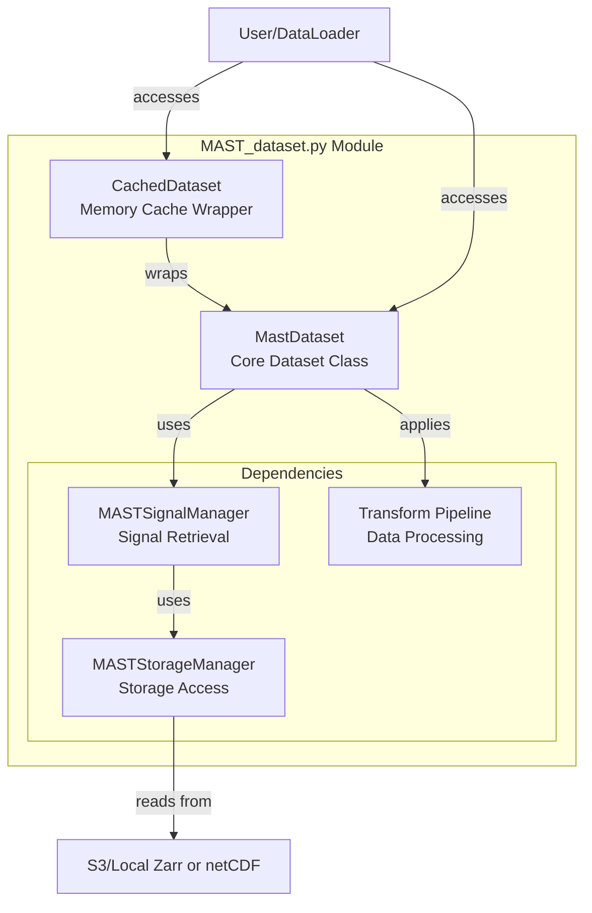
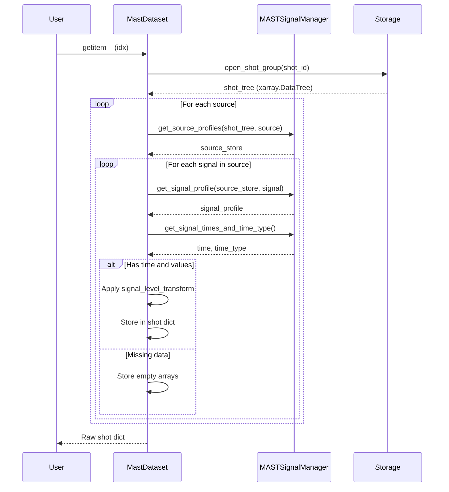

# MAST_dataset.py Module Documentation

The [`MAST_dataset.py`](../src/MAST_tools/MAST_dataset.py) module provides PyTorch-compatible dataset classes for 
accessing and processing MAST (Mega Ampere Spherical Tokamak) fusion plasma data. It contains two main classes that 
work together to provide efficient data loading with caching capabilities.

---

## Module Overview



---

## Class 1: CachedDataset

### Purpose
A lightweight wrapper that caches dataset items in memory to avoid redundant loading operations. Implements lazy 
caching - items are loaded once on first access and stored for subsequent requests.

### Class Definition
```python
class CachedDataset(Dataset):
    """Cache a base dataset into local memory."""
```

### Attributes
- **`base_dataset`** (`Sequence`): The underlying dataset to cache
- **`cache`** (`list[Any]`): List storing cached items (initialized with `None`)
- **`_is_cached`** (`list[bool]`): Flags tracking which items are cached

### Methods


<!--- ============================================================================= -->
<details>
<summary><code> __init__(base_dataset: Sequence) </code></summary>

Initializes the cache structure with the same length as the base dataset.

```python
self.cache = [None] * len(base_dataset)
self._is_cached = [False] * len(base_dataset)
```
</details>
<!--- ============================================================================= -->


<!--- ============================================================================= -->
<details>
<summary><code> __len__() -> int </code></summary>

Returns the size of the base dataset.

</details>
<!--- ============================================================================= -->


<!--- ============================================================================= -->
<details>
<summary><code> __getitem__(idx: int) -> Any </code></summary>

Retrieves an item by index, loading and caching it on first access:

```python
if not self._is_cached[idx]:
    self.cache[idx] = self.base_dataset[idx]  # Load once
    self._is_cached[idx] = True
return self.cache[idx]  # Return cached item
```

</details>
<!--- ============================================================================= -->


### Usage Pattern
```python
base_dataset = MastDataset(...)
cached_dataset = CachedDataset(base_dataset)
# First access: loads and caches
item = cached_dataset[0]
# Subsequent accesses: returns cached item
item = cached_dataset[0]  # No reload!
```

---

## Class 2: MastDataset

### Purpose
The core PyTorch `Dataset` implementation for MAST data. Handles:
- Loading shot data via `xarray` (Zarr or netCDF, local or S3)
- Applying signal-level transforms
- Managing incomplete shots and outliers
- Providing flexible data access patterns

### Class Definition
```python
class MastDataset(Dataset):
    """Dataset class for MAST data."""
```

### Key Attributes

| Attribute | Type | Description |
|-----------|------|-------------|
| `local` | `bool` | If `True`, use local data files; else use S3 |
| `shots_list` | `list[int]` | List of shot IDs to load |
| `source_signal_list` | `list[list[str]]` | Signals to load as `[[source, signal], ...]` |
| `signal_level_transform_map` | `Optional[Mapping[str, Callable]]` | Per-signal transforms (e.g., standardization) |
| `remove_outliers` | `bool` | If `True`, filter outlier signals |
| `sig` | `MASTSignalManager` | Signal retrieval interface |
| `verbose` | `bool` | Enable detailed logging |

### Constructor Parameters

```python
def __init__(
    self,
    local: bool,
    shots_list: list[int],
    source_signal_list: list[list[str], tuple[str]],
    signal_level_transform_map: Optional[Mapping[str, Callable]] = None,
    remove_outliers: bool = False,
    outlier_metadata_file: str = DEFAULT_OUTLIER_METADATA_FILE,
    store_manager_settings: StoreManagerParametersType | None = None,
    verbose: bool = False
)
```

**Parameter Details:**

- **`local`**: Boolean flag for storage location
  - `True`: Use local data database (Zarr or netCDF)
  - `False`: Use remote S3 bucket
  
- **`shots_list`**: List of shot IDs to include in dataset
  - Example: `[30421, 30422, 30423]`
  
- **`source_signal_list`**: Nested list of [source, signal] pairs
  - Example: `[["summary", "power_nbi"], ["magnetics", "b_field_pol_probe_obr_field"]]`
  
- **`signal_level_transform_map`**: Dictionary mapping signal names to transform functions
  - Keys: `"source-signal"` format
  - Values: Callable transforms (e.g., `StdScalingTransform`)
  
- **`remove_outliers`**: Enable outlier filtering
  - Uses metadata from `outlier_metadata_file`
  - Replaces outlier signals with empty arrays
  
- **`outlier_metadata_file`**: Path to YAML file with outlier definitions
  - Default: `DEFAULT_OUTLIER_METADATA_FILE`
  
- **`store_manager_settings`**: Configuration for storage manager
  - Optional dictionary with storage parameters
  - Example: `{"target_fsspec_protocol": "s3"}`
  
- **`verbose`**: Enable detailed logging output


### Core Methods


<!--- ============================================================================= -->
<details>
<summary><code> __len__() -> int </code></summary>

Returns the number of shots in the dataset.

```python
return len(self.shots_list)
```

</details>
<!--- ============================================================================= -->


<!--- ============================================================================= -->
<details>
<summary><code> __getitem__(idx: int) -> dict </code></summary>

The main data loading method. Returns a **dictionary** of signals.

**Data Loading Pipeline:**



**Key Implementation Details:**

1. **Outlier Handling** (lines 273-284):
```python
if self.remove_outliers:
    all_outliers = set(self.dict_outlier_metadata.get(shot_id, []))
    # Replace outlier signals with empty arrays
    if f"{source}-{signal}" in all_outliers:
        shot[f"{source}-{signal}"] = {"time": np.array([]), "values": np.array([])}
```

2. **Signal Grouping** (lines 286-292):
Groups signals by source for efficient batch loading:
```python
source_signals = {}
for source, signal in source_signal_to_load:
    if source in source_signals:
        source_signals[source].append(signal)
    else:
        source_signals[source] = [signal]
```

3. **Signal Retrieval** (lines 296-343):
```python
for source in source_signals:
    source_store = self.sig.get_source_profiles(shot_tree, source)
    for signal in source_signals[source]:
        signal_profile = self.sig.get_signal_profile(source_store, signal)
        shot_time, _ = self.sig.get_signal_times_and_time_type(...)
        shot_vals = signal_profile.values
        
        # Apply signal-level transform
        if self.signal_level_transform_map:
            shot[f"{source}-{signal}"] = self.signal_level_transform_map[f"{source}-{signal}"](
                {"time": shot_time, "values": shot_vals}
            )
```

</details>
<!--- ============================================================================= -->


<!--- ============================================================================= -->
<details>
<summary><code> get_shot_id(idx: int) -> int </code></summary>

Returns the shot ID for a given index.

```python
return self.shots_list[idx]
```

**Usage:**
```python
dataset = MastDataset(shots_list=[30421, 30422, 30423], ...)
shot_id = dataset.get_shot_id(0)  # Returns 30421
```

</details>
<!--- ============================================================================= -->


<!--- ============================================================================= -->
<details>
<summary><code> get_windows_for_shot(idx: int) -> list </code></summary>

Returns the list of windows for a shot. Useful for understanding how many training samples a shot produces.

```python
obj = self.__getitem__(idx)
if isinstance(obj, list):
    return obj  # List of windows
else:
    return [obj]  # Single window (raw shot)
```

**Usage:**
```python
windows = dataset.get_windows_for_shot(0)
print(f"Shot produces {len(windows)} windows")
```

</details>
<!--- ============================================================================= -->


---

## Data Structure

### Shot Dictionary Format
Each shot is represented as a dictionary with signal keys:

```python
{
    "source1-signal1": {
        "time": np.ndarray,    # Shape: (n_timesteps,)
        "values": np.ndarray   # Shape: (n_channels, n_timesteps) or (n_timesteps,)
    },
    "source2-signal2": {
        "time": np.ndarray,
        "values": np.ndarray
    },
    ...
}
```

### Example Signal Keys
- `"summary-power_nbi"`: NBI power from summary source
- `"magnetics-b_field_pol_probe_obr_field"`: Poloidal magnetic field
- `"magnetics-b_field_pol_probe_omv_voltage"`: Magnetic probe voltage
- `"thomson_scattering-n_e"`: Electron density profile
- `"charge_exchange-t_i"`: Ion temperature

### Signal Value Shapes
- **Scalar signals**: `(n_timesteps,)` - single value per timestep
- **Profile signals**: `(n_channels, n_timesteps)` - spatial profile per timestep
- **Multi-channel signals**: `(n_channels, n_timesteps)` - multiple measurements

---

## Transform Pipeline

### Signal-Level Transforms
Applied to individual signals before shot assembly. Common transforms include:

**Standardization:**
```python
from tokamark.tools.transforms.stdscale_transform import StdScalingTransform

signal_level_transform_map = {
    "summary-power_nbi": StdScalingTransform(mean=1.5e6, std=5e5),
    "magnetics-b_field_pol_probe_obr_field": StdScalingTransform(mean=0.0, std=0.1)
}
```

**Composition:**
```python
from tokamark.tools.transforms.compose_transform import ComposeTransforms

signal_level_transform_map = {
    "lcfs-r": ComposeTransforms([
        ReshapeLcfsTransform(),
        StdScalingTransform(mean=1.2, std=0.3)
    ])
}
```

---

## Usage Examples

### Basic Usage
```python
from MAST_tools.MAST_dataset import MastDataset

dataset = MastDataset(
    local=True,
    shots_list=[30421, 30422, 30423],
    source_signal_list=[
        ["summary", "power_nbi"],
        ["magnetics", "b_field_pol_probe_obr_field"]
    ],
    signal_level_transform_map=None,
)

# Access shot data
shot = dataset[0]  # Returns dict with signal data
print(f"Shot ID: {dataset.get_shot_id(0)}")
print(f"Signals: {list(shot.keys())}")
print(f"Power NBI shape: {shot['summary-power_nbi']['values'].shape}")
```

### With Transforms
```python
from tokamark.tools.MAST_composite_transform import build_common_signal_transform_map

# Build transform map with standardization
transform_map = build_common_signal_transform_map(
    source_signal_list=[
        ["summary", "power_nbi"],
        ["magnetics", "b_field_pol_probe_obr_field"]
    ],
    use_std_scaling=True
)

dataset = MastDataset(
    local=True,
    shots_list=[30421],
    source_signal_list=[
        ["summary", "power_nbi"],
        ["magnetics", "b_field_pol_probe_obr_field"]
    ],
    signal_level_transform_map=transform_map,
)

# Returns list of windows
windows = dataset[0]
print(f"Number of windows: {len(windows)}")
print(f"Window 0 keys: {list(windows[0].keys())}")
```

### With Caching
```python
from MAST_tools.MAST_dataset import MastDataset, CachedDataset
from torch.utils.data import DataLoader

# Create base dataset
base_dataset = MastDataset(
    local=True,
    shots_list=[30421, 30422, 30423],
    source_signal_list=[["summary", "power_nbi"]],
)

# Wrap with caching
cached_dataset = CachedDataset(base_dataset)

# Use with PyTorch DataLoader
dataloader = DataLoader(
    cached_dataset,
    batch_size=32,
    shuffle=True,
    num_workers=4
)

for batch in dataloader:
    # Process batch
    pass
```

### Handling Outliers and Incomplete Shots
```python
dataset = MastDataset(
    local=True,
    shots_list=[30421, 30422],
    source_signal_list=[
        ["summary", "power_nbi"],
        ["thomson_scattering", "n_e"]
    ],
    remove_outliers=True           # Filter known outliers
)

# Check for missing signals
shot = dataset[0]
for signal_key, signal_data in shot.items():
    if signal_data["values"].size == 0:
        print(f"{signal_key} is missing or was an outlier")
```

### Remote S3 Access
```python
dataset = MastDataset(
    local=False,  # Use S3 storage
    shots_list=[30421],
    source_signal_list=[["summary", "power_nbi"]],
    store_manager_settings={
        "target_fsspec_protocol": "s3",
        "s3_endpoint_url": "https://s3.echo.stfc.ac.uk",
        "s3_mast_dataset_path": "/mast/tokamark/v1"
    }
)
```

---

## Error Handling

The module includes robust error handling for common issues:

### 1. Missing Signals
Returns empty arrays instead of raising exceptions:
```python
shot[f"{source}-{signal}"] = {"time": np.array([]), "values": np.array([])}
```

### 2. Time Retrieval Errors
Catches exceptions during time array retrieval:
```python
try:
    shot_time, _ = self.sig.get_signal_times_and_time_type(...)
except Exception as e:
    print(f"Error getting time for shot {shot_id}: {e}")
    shot_time = None
```

### 3. Value Extraction Errors
Handles missing value attributes:
```python
try:
    shot_vals = signal_profile.values
except AttributeError:
    shot_vals = None
```

### 4. Index Errors
`get_windows_for_shot()` returns empty list for invalid indices:
```python
try:
    obj = self.__getitem__(idx)
except IndexError:
    return []
```

---

## Performance Considerations

### Memory Efficiency
- **Lazy Loading**: Data loaded only when accessed via `__getitem__`
- **Optional Caching**: Use `CachedDataset` only when memory allows
- **Selective Loading**: Load only required signals, not entire shots
- **Empty Arrays**: Missing signals stored as empty arrays (minimal memory)

### I/O Optimization
- **Grouped Reads**: Signals from same source loaded together
- **Chunked Reads**: Efficient partial array reads from chunked storage (Zarr chunks / netCDF HDF5 chunks)
- **fsspec Caching**: Disk cache for remote data (simplecache protocol)
- **Batch Operations**: Vectorized numpy operations

### Scalability
- **Streaming Support**: Compatible with `IterableDataset` wrappers
- **Multi-worker**: Works with PyTorch's multi-process data loading
- **Batch Processing**: Efficient collation for training
- **Subset Selection**: Easy to create train/val/test splits

### Best Practices

**For Small Datasets (< 100 shots):**
```python
# Use caching for fast repeated access
cached_dataset = CachedDataset(MastDataset(...))
```

**For Large Datasets (> 1000 shots):**
```python
# Use multi-worker DataLoader without caching
dataset = MastDataset(...)
dataloader = DataLoader(dataset, num_workers=4, prefetch_factor=2)
```

**For Remote Data:**
```python
# Enable fsspec caching
dataset = MastDataset(
    local=False,
    store_manager_settings={
        "base_fsspec_protocol": "simplecache",  # Enable disk cache
        "target_fsspec_protocol": "s3"
    }
)
```

---

## Integration with Benchmark Framework

The `MastDataset` is typically wrapped by `TokaMarkDataset` for benchmark tasks:

```python
from tokamark.data import initialize_MAST_dataset, initialize_TokaMark_dataset
from tokamark.tasks import get_task_config, get_task_metadata
from tokamark.data_split import get_train_test_val_shots

# Step 1: Get task configuration
task_config = get_task_config("task_1-1")
task_metadata = get_task_metadata(task_config)

# Step 2: Get shot splits
train_shots, test_shots, val_shots = get_train_test_val_shots()

# Step 3: Create MastDataset
mast_dataset = initialize_MAST_dataset(
    config_task=task_config,
    shots_list=train_shots,
    local_flag=True,
    use_std_scaling=True,
    remove_outliers=True
)

# Step 4: Wrap with TokaMarkDataset for windowing
tokamark_dataset = initialize_TokaMark_dataset(
    dataset=mast_dataset,
    task_metadata=task_metadata,
    config_metadata=config_metadata
)

# Step 5: Use with DataLoader
from torch.utils.data import DataLoader
dataloader = DataLoader(tokamark_dataset, batch_size=32, shuffle=True)

for batch in dataloader:
    # Train model
    predictions = model(batch['x'])
    loss = criterion(predictions, batch['y'])
```

---

## Testing

The module includes a `tests()` function for basic functionality verification:

```python
from MAST_tools.MAST_dataset import tests

# Run module tests
tests()
```

**Test Coverage:**
- Dataset initialization
- Shot retrieval
- Signal loading
- Transform application
- Window generation

**Example Test Output:**
```
dummy_dataset.__len__: 1
dummy_dataset.get_shot_id(0): 30421
dummy_dataset.__getitem__(0):
{'magnetics-b_field_pol_probe_obr_field': {'time': array([...]), 'values': array([...])},
 'magnetics-b_field_pol_probe_omv_voltage': {'time': array([...]), 'values': array([...])},
 'magnetics-b_field_tor_probe_omaha_channel': {'time': array([...]), 'values': array([...])},
 'summary-power_nbi': {'time': array([...]), 'values': array([...])}}
```

---

## Common Issues and Solutions

### Issue 1: Empty Dataset
**Problem**: `len(dataset)` returns 0 or `dataset[0]` returns empty list

**Solutions:**
- Check that `shots_list` contains valid shot IDs
- Verify signals exist in storage using `MASTStorageManager.list_shots_by_signal_availability()`
- Check `verbose=True` for detailed loading information

### Issue 2: Slow Loading
**Problem**: Data loading is very slow

**Solutions:**
- Use `CachedDataset` for repeated access to same shots
- Enable fsspec caching for remote data
- Use multi-worker DataLoader: `DataLoader(dataset, num_workers=4)`
- Reduce number of signals loaded
- Use local storage instead of S3 if possible

### Issue 3: Memory Errors
**Problem**: Out of memory errors during training

**Solutions:**
- Don't use `CachedDataset` for large datasets
- Reduce batch size in DataLoader
- Load fewer signals per shot
- Use gradient accumulation instead of large batches

### Issue 4: Missing Signals
**Problem**: Some signals are always empty

**Solutions:**
- Check signal availability in metadata files
- Verify signal names match exactly (case-sensitive)
- Use `remove_outliers=True` to filter known bad signals
- Check that shot IDs have the required signals

---

## API Reference Summary

### CachedDataset
```python
CachedDataset(base_dataset: Sequence)
    __len__() -> int
    __getitem__(idx: int) -> Any
```

### MastDataset
```python
MastDataset(
    local: bool,
    shots_list: list[int],
    source_signal_list: list[list[str], tuple[str]],
    signal_level_transform_map: Optional[Mapping[str, Callable]] = None,
    remove_outliers: bool = False,
    outlier_metadata_file: str = DEFAULT_OUTLIER_METADATA_FILE,
    store_manager_settings: StoreManagerParametersType | None = None,
    verbose: bool = False
)
    __len__() -> int
    __getitem__(idx: int) -> dict
    get_shot_id(idx: int) -> int
    get_windows_for_shot(idx: int) -> list
```

---

## Summary

The [`MAST_dataset.py`](../src/MAST_tools/MAST_dataset.py) module provides:

✅ **Flexible Data Access**: Supports local and remote storage  
✅ **Transform Pipeline**: Signal-level transforms  
✅ **Robust Handling**: Manages incomplete shots and outliers  
✅ **Memory Caching**: Optional in-memory caching via `CachedDataset`  
✅ **PyTorch Integration**: Full compatibility with DataLoader  
✅ **Performance**: Lazy loading, grouped reads, and efficient I/O  
✅ **Error Resilience**: Graceful handling of missing data  
✅ **Scalability**: Works with datasets from tens to thousands of shots  

This module serves as the foundation for all data access in the FAIR-MAST benchmark framework, providing a clean and 
efficient interface between the raw shot storage (Zarr or netCDF) and PyTorch training pipelines.
