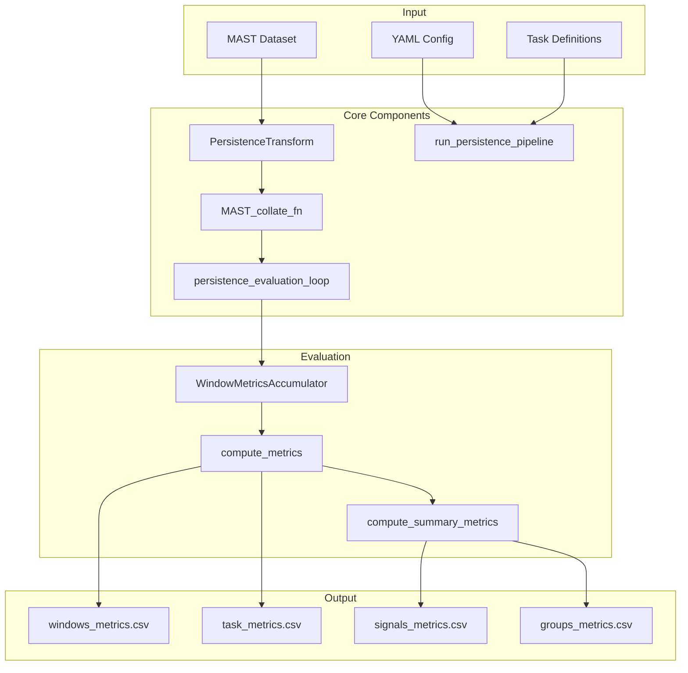
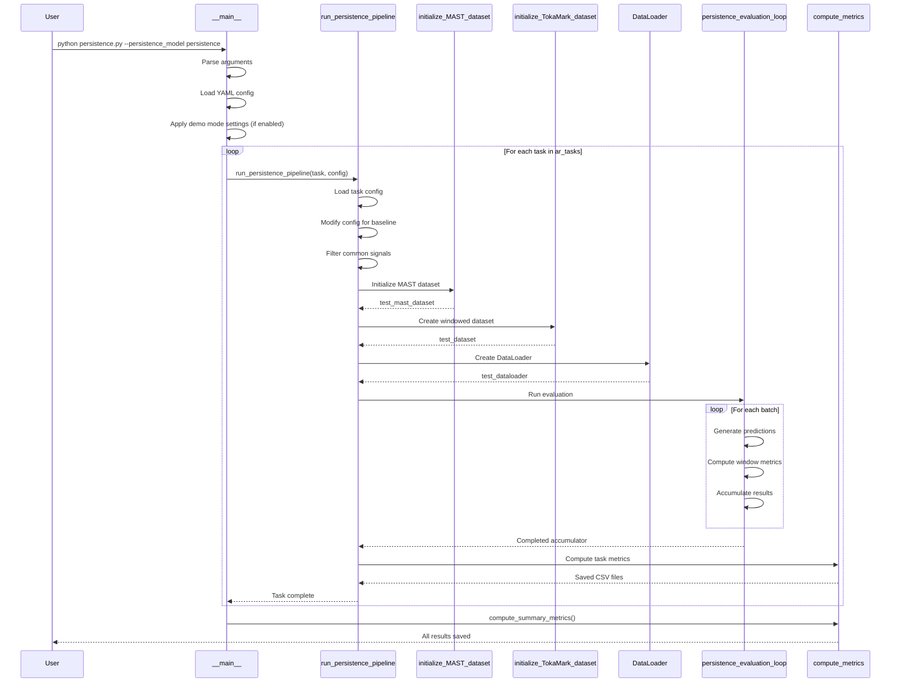

# Tutorial: `scripts/persistence.py` - Baseline Model Evaluation

## Overview

The [`scripts/persistence.py`](../scripts/persistence.py) module implements **baseline models** for the TokaMark benchmark. It provides two simple forecasting approaches that serve as performance baselines for more sophisticated machine learning models:

1. **Persistence Model**: Predicts that future values will equal the last observed value
2. **Mean Model**: Predicts that future values will equal the historical mean of each signal

These baselines are essential for establishing minimum performance thresholds and validating that ML models provide meaningful improvements.

---

## Architecture Overview



---

## Key Components

### 1. PersistenceTransform Class

**Purpose**: Extracts input and output signals from data segments for baseline evaluation.

**Location**: Lines 38-114 in `scripts/persistence.py`

```python
class PersistenceTransform:
    """Transform that extracts signals for persistence/mean models."""
    
    def __init__(self, signals: list[str]) -> None:
        """
        Parameters
        ----------
        signals : list[str]
            List of signal names in format "source-signal"
            Example: ["magnetics-flux_loop_flux", "thomson_scattering-n_e"]
        """
        self.signals = signals
    
    def __call__(self, segment: Mapping[str, Any]) -> dict[str, Any]:
        """
        Extract signal data from a segment.
        
        Returns
        -------
        dict with keys:
            - shot_id: Shot identifier
            - window_index: Window position in shot
            - x: Dict of input signals {signal_name: values}
            - y: Dict of output signals {signal_name: values}
        """
```

**Key Features**:
- Filters signals to only those present in both input and output
- Extracts signal values from nested segment structure
- Returns standardized format for evaluation

---

### 2. MAST_collate_fn Function

**Purpose**: Custom collate function for batching data samples.

**Location**: Lines 116-173 in `scripts/persistence.py`

```python
def MAST_collate_fn(batch: Sequence, verbose: bool = True) -> list | None:
    """
    Collate function that flattens batch and provides memory diagnostics.
    
    Returns
    -------
    Tuple of (shot_ids, window_indices, x_dict, y_dict) or None if empty
    """
```

**Key Features**:
- Flattens batch structure for efficient processing
- Provides memory usage diagnostics when `verbose=True`
- Handles empty batches gracefully
- Reports tensor sizes for monitoring

---

### 3. persistence_evaluation_loop Function

**Purpose**: Core evaluation loop that generates predictions and computes metrics.

**Location**: Lines 178-278 in `scripts/persistence.py`

```python
def persistence_evaluation_loop(
    test_dataloader: DataLoader,
    feature_names: list[str],
    accumulator: WindowMetricsAccumulator,
    model: str = "persistence"
):
    """
    Evaluate baseline model and accumulate metrics.
    
    Parameters
    ----------
    test_dataloader : DataLoader
        Test data loader
    feature_names : list[str]
        List of signal names to evaluate
    accumulator : WindowMetricsAccumulator
        Metrics accumulator instance
    model : str
        Either "persistence" or "mean"
    """
```

**Prediction Logic**:

**Persistence Model**:
```python
# For each signal, use last input value as prediction
last_value = x_test[signal][..., -1]  # Last timestep
y_pred[signal] = last_value.expand_as(y_test[signal])  # Repeat for all output steps
```

**Mean Model**:
```python
# For each signal, use historical mean as prediction
mean_value = signal_metadata[signal]["mean"]
y_pred[signal] = ones_like(y_test[signal]) * mean_value
```

**Metrics Computation**:
- Computes RMSE and MAE per window
- Handles missing features gracefully
- Skips windows with NaN values
- Accumulates results for aggregation

---

### 4. run_persistence_pipeline Function

**Purpose**: Main orchestration function that runs the complete evaluation pipeline.

**Location**: Lines 281-435 in `scripts/persistence.py`

```python
def run_persistence_pipeline(
    task: str,
    pipeline_config: Mapping[str, Any]
) -> None:
    """
    Run complete persistence/mean model evaluation pipeline.
    
    Steps:
    1. Load and modify task configuration
    2. Initialize MAST dataset
    3. Create TokaMark windowed dataset
    4. Run evaluation loop
    5. Compute and save metrics
    """
```

**Pipeline Steps**:

1. **Task Configuration Modification**:
   - Sets task type to "markovian" for compatibility
   - Filters signals to those present in both input and output
   - Removes actuator signals (not needed for baselines)

2. **Dataset Initialization**:
   ```python
   test_mast_dataset = initialize_MAST_dataset(
       config_task=config_task,
       shots_list=test_shots,
       local_flag=pipeline_config["local"],
       use_std_scaling=True,
   )
   ```

3. **Windowed Dataset Creation**:
   ```python
   test_dataset = initialize_TokaMark_dataset(
       dataset=test_mast_dataset,
       task_metadata=dict_task_metadata,
       config_metadata=config_task,
       custom_transform=PersistenceTransform(signals=chosen_signals)
   )
   ```

4. **Evaluation**:
   ```python
   accumulator = WindowMetricsAccumulator(task=task)
   persistence_evaluation_loop(
       test_dataloader=test_dataloader,
       feature_names=chosen_signals,
       accumulator=accumulator,
       model=pipeline_config["persistence_settings"]["model"]
   )
   ```

5. **Metrics Computation**:
   ```python
   compute_metrics(
       task=task,
       output_dir=output_dir,
       window_metrics_accumulator=accumulator,
       save_windows_metrics=True,
       save_task_metrics=True
   )
   ```

---

## Configuration Files

### Persistence Model Config

**File**: `scripts/config_files/config_persistence_model.yaml`

```yaml
local: false  # Use remote S3 storage

get_shots_settings:
  max_index:        # Use all available shots
  shuffle: false
  seed: 42

store_manager_settings:
  base_local_data_path: /mast/tokamark/v1

dataloader_settings:
  batch_size: 10
  num_workers: 10

persistence_settings:
  model: persistence  # Model type
  compute_summary_metrics: true
  save_windows_metrics: false
  save_task_metrics: true
  output_dir: ../output/persistence
  ar_tasks:  # Auto-regressive tasks to evaluate
    - task_3-1
    - task_3-2
    - task_4-1
    - task_4-2
    - task_4-4
    - task_4-5
```

### Mean Model Config

**File**: `scripts/config_files/config_mean_model.yaml`

```yaml
persistence_settings:
  model: mean  # Use mean baseline instead
  output_dir: ../output/mean
  ar_tasks:
    - task_1-1
    - task_1-2
    - task_1-3
    - task_2-1
    - task_2-2
    - task_2-3
    - task_3-1
    - task_3-2
    - task_3-3
    - task_4-1
    - task_4-2
    - task_4-3
    - task_4-4
    - task_4-5
```

---

## Usage Examples

### Basic Usage

```bash
# Run persistence model on all configured tasks
python scripts/persistence.py --persistence_model persistence

# Run mean model
python scripts/persistence.py --persistence_model mean
```

### Demo Mode

```bash
# Run on subset of data for testing
python scripts/persistence.py --persistence_model persistence --demo_mode

# Custom demo suffix
python scripts/persistence.py --persistence_model persistence --demo_mode --demo_suffix "_TEST"
```

### Programmatic Usage

```python
from scripts.persistence import run_persistence_pipeline
from tokamark.tools.utils import get_config_from_yaml

# Load configuration
config = get_config_from_yaml("config_files/config_persistence_model.yaml")

# Run for specific task
run_persistence_pipeline(task="task_2-1", pipeline_config=config)
```

---

## Execution Flow



---

## Output Files

### Directory Structure

```
output/
├── persistence/              # Persistence model results
│   ├── task_3-1/
│   │   ├── windows_metrics.csv    # Per-window RMSE/MAE
│   │   ├── shots_metrics.csv      # Per-shot aggregation
│   │   └── task_metrics.csv       # Task-level summary
│   ├── task_3-2/
│   ├── ...
│   ├── signals_metrics.csv        # Per-signal summary
│   └── groups_metrics.csv         # Per-group summary
│
└── mean/                          # Mean model results
    └── (similar structure)
```

### Metrics Files

**windows_metrics.csv**:
```csv
shot_id,window_index,feature_name,RMSE,MAE
30420,0,magnetics-flux_loop_flux,0.0234,0.0189
30420,1,magnetics-flux_loop_flux,0.0256,0.0201
```

**task_metrics.csv**:
```csv
feature_name,n_shots,NRMSE_mean,NRMSE_std_pop,NMAE_mean,NMAE_std_pop,RMSE_mean,RMSE_std_pop,MAE_mean,MAE_std_pop
magnetics-flux_loop_flux,150,0.234,0.045,0.189,0.038,0.0245,0.0048,0.0198,0.0041
```

---

## Key Concepts

### 1. Why Baseline Models?

**Persistence Model**:
- Assumes system state changes slowly
- Predicts: "Tomorrow will be like today"
- Good for stable, slowly-varying signals
- Common in time-series forecasting

**Mean Model**:
- Assumes signals fluctuate around a mean
- Predicts: "Future will equal historical average"
- Good for stationary processes
- Provides absolute minimum performance bar

### 2. Task Configuration Modification

The pipeline modifies task configs because:
- Baseline models don't use actuators
- Only signals present in both input/output can be evaluated
- Task type must be "markovian" for proper batching

### 3. Metrics Hierarchy

```
Window Level (RMSE, MAE)
    ↓ Average across windows
Shot Level (RMSE, MAE per shot)
    ↓ Average across shots
Signal Level (NRMSE, NMAE per signal)
    ↓ Average across signals
Task Level (Overall task performance)
    ↓ Average across tasks
Group Level (Group performance)
```

---

## Advanced Features

### Demo Mode

Useful for testing without processing entire dataset:

```python
if args.demo_mode:
    config["get_shots_settings"]["max_index"] = 2  # Only 2 shots
    config["get_shots_settings"]["shuffle"] = False
    config["persistence_settings"]["output_dir"] += "_DEMO"
    config["persistence_settings"]["ar_tasks"] = [
        config["persistence_settings"]["ar_tasks"][0]  # Only first task
    ]
```

### Memory Monitoring

The collate function provides memory diagnostics:

```python
proc = psutil.Process(pid=os.getpid())
mem = proc.memory_info().rss / (1024**2)
print(f"[Worker PID={proc.pid}] Memory={mem:.2f} MB")
```

### NaN Handling

Robust handling of missing data:

```python
def contains_nans(data: Any) -> bool:
    return any(np.isnan(x_).any() for x_ in data)

if not contains_nans(data=last):
    y_pred[key] = last.expand_as(other=y_test[key])
```

---

## Best Practices

### 1. Configuration Management

```python
# Override default settings programmatically
config["store_manager_settings"]["base_local_data_path"] = "/custom/path"
```

### 2. Error Handling

```python
try:
    # Compute metrics
    accumulator.add_batch(...)
except KeyError:
    warning_print(f"Missing feature {feature_name}, skipping.")
```

### 3. Resource Management

```python
# Set multiprocessing method
mp.set_start_method(method="spawn", force=True)

# Configure workers based on CPU count
print(f"Number of available CPU cores: {cpu_count()}")
```

---

## Integration with TokaMark

The persistence module integrates with the broader TokaMark ecosystem:

1. **Uses** `tokamark.tasks` for task definitions
2. **Uses** `tokamark.data` for dataset initialization
3. **Uses** `tokamark.evaluator` for metrics computation
4. **Provides** baseline performance for comparison with ML models

---

## Common Use Cases

### 1. Establish Performance Baseline

```bash
# Run both baselines on all tasks
python scripts/persistence.py --persistence_model persistence
python scripts/persistence.py --persistence_model mean
```

### 2. Quick Validation

```bash
# Test pipeline on small subset
python scripts/persistence.py --persistence_model persistence --demo_mode
```

### 3. Custom Task Evaluation

```python
# Evaluate specific task
config = get_config_from_yaml("config_persistence_model.yaml")
config["persistence_settings"]["ar_tasks"] = ["task_2-1"]
run_persistence_pipeline(task="task_2-1", pipeline_config=config)
```

---

## Troubleshooting

### Common Issues

**Issue**: "No common signals between input and output"
- **Cause**: Task has no overlapping signals between input and output
- **Solution**: This is expected for some tasks; persistence model cannot be applied

**Issue**: "Empty batch skipped"
- **Cause**: Data loader returned no valid samples
- **Solution**: Check shot availability and signal completeness

**Issue**: "Missing feature for batch, or last elements are NaN values"
- **Cause**: Signal contains NaN values in the last timestep
- **Solution**: This is handled gracefully; the window is skipped

### Performance Tips

1. **Adjust batch size**: Larger batches = faster processing but more memory
2. **Tune num_workers**: Set to number of CPU cores for optimal I/O
3. **Use local mode**: If dataset is downloaded locally, set `local: true`
4. **Enable caching**: fsspec simplecache reduces repeated S3 reads

---

## Summary

The `scripts/persistence.py` module provides:

✅ **Two baseline models** (persistence and mean)  
✅ **Complete evaluation pipeline** with metrics computation  
✅ **Flexible configuration** via YAML files  
✅ **Robust error handling** for missing data  
✅ **Memory monitoring** and diagnostics  
✅ **Integration** with TokaMark benchmark framework  

These baselines are essential for validating that machine learning models provide meaningful improvements over simple forecasting approaches.

---

## References

- **Main Module**: `scripts/persistence.py`
- **Configuration Files**: `scripts/config_files/config_persistence_model.yaml`, `scripts/config_files/config_mean_model.yaml`
- **Related Modules**: 
  - `src/tokamark/evaluator.py` - Metrics computation
  - `src/tokamark/tasks.py` - Task definitions
  - `src/tokamark/data.py` - Dataset initialization
- **TokaMark Paper**: [TokaMark: A Comprehensive Benchmark for MAST Tokamak Plasma Models](https://arxiv.org/abs/2602.10132)